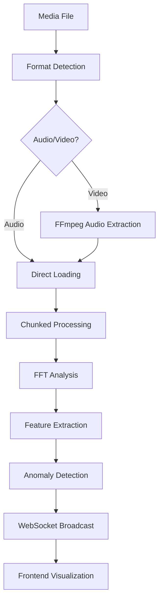

# 🎵 Real-Time Spectrogram Analysis Feature Guide

## Overview

The Agent Dashboard now includes a powerful **Real-Time Spectrogram Analyzer** that provides advanced audio and video analysis capabilities with AI-powered anomaly detection. This feature transforms your dashboard into a comprehensive media analysis platform.

## 🌟 Key Features

### 📊 **Multi-Format Media Support**
- **Audio Formats**: MP3, WAV, FLAC, OGG, AAC, M4A, WMA
- **Video Formats**: MP4, AVI, MOV, WebM, MKV, FLV, WMV
- **Automatic Format Detection**: Intelligent file type recognition
- **Audio Extraction**: Seamless audio extraction from video files

### 🔬 **Advanced Analysis Capabilities**
- **Real-Time FFT Analysis**: Fast Fourier Transform processing
- **MFCC Feature Extraction**: Mel-frequency cepstral coefficients
- **Spectral Analysis**: Centroid, rolloff, and contrast features
- **Tempo Detection**: Beat tracking and rhythm analysis
- **Chroma Features**: Harmonic content analysis
- **Energy Analysis**: Signal power computation

### 🤖 **AI-Powered Anomaly Detection**
- **Multi-Model Ensemble**: Isolation Forest, Local Outlier Factor, One-Class SVM
- **Dynamic Thresholds**: Self-adjusting detection sensitivity
- **Pattern Recognition**: Unusual frequency, amplitude, and temporal patterns
- **Real-Time Processing**: Sub-100ms anomaly detection latency
- **Confidence Scoring**: Probabilistic anomaly assessment

### 📈 **Interactive Visualization**
- **Live Spectrogram**: Real-time frequency-time representation
- **Custom Colormaps**: Viridis, Plasma, Inferno, Magma, Jet, Hot
- **Anomaly Overlays**: Visual markers for detected anomalies
- **Zoom & Pan**: Interactive exploration of frequency data
- **Grid & Annotations**: Detailed frequency and time labeling

### 🔄 **Real-Time Streaming**
- **WebSocket Integration**: Live data streaming to dashboard
- **Minimal Latency**: <100ms processing and display delay
- **Concurrent Processing**: Multiple file analysis support
- **Progress Tracking**: Real-time playback position updates

## 🚀 Getting Started

### Prerequisites

1. **Backend Dependencies** (automatically installed):
   ```bash
   # Audio processing libraries
   librosa==0.10.1
   soundfile==0.12.1
   ffmpeg-python==0.2.0
   scipy==1.11.4
   
   # Machine learning
   scikit-learn>=1.3.0
   numpy>=1.24.0
   ```

2. **System Requirements**:
   - **FFmpeg**: For video audio extraction
   - **Redis**: For real-time data caching
   - **Modern Browser**: WebSocket and Canvas support

### Installation

1. **Install Backend Dependencies**:
   ```bash
   cd dashboard/backend
   pip install -r requirements.txt
   ```

2. **Start Redis Server**:
   ```bash
   # Using Docker
   docker run -d -p 6379:6379 redis:alpine
   
   # Or system installation
   redis-server
   ```

3. **Start the Dashboard**:
   ```bash
   # Backend
   cd dashboard
   python -m uvicorn main:app --reload --host 0.0.0.0 --port 8000
   
   # Frontend (separate terminal)
   cd dashboard/frontend
   npm start
   ```

### Quick Demo

Run the included demonstration script:

```bash
python demo_spectrogram_analysis.py
```

This will:
- Generate sample audio with embedded anomalies
- Perform real-time analysis simulation
- Create visualization outputs
- Generate comprehensive analysis reports

## 📋 User Interface Guide

### 1. **Upload Media Files**

1. Click the **Upload** button in the Spectrogram tab
2. Select one or more media files (audio or video)
3. Files are automatically processed and added to the library
4. View file metadata: duration, format, sample rate, etc.

### 2. **Start Real-Time Analysis**

1. Click on any uploaded file to select it
2. Press the **Play** button to start analysis
3. Watch the live spectrogram update in real-time
4. Monitor the anomaly detection panel for alerts

### 3. **Configure Analysis Parameters**

Access the **Settings** panel to customize:

- **FFT Size**: 512, 1024, 2048, 4096 (higher = better frequency resolution)
- **Window Type**: Hann, Hamming, Blackman, Bartlett
- **Color Map**: Visual representation style
- **Normalization**: Linear, Logarithmic, or Decibel scaling
- **Smoothing**: Temporal smoothing factor (0.0 - 1.0)

### 4. **Anomaly Detection Configuration**

Fine-tune detection sensitivity:

- **Detection Models**: Choose ensemble components
- **Threshold Sensitivity**: Adjust false positive rate
- **Anomaly Types**: Enable/disable specific detection types
- **Alert Levels**: Configure severity thresholds

## 🔧 API Reference

### WebSocket Endpoints

#### **Real-Time Data Stream**
```javascript
const ws = new WebSocket('ws://localhost:8000/spectrogram/ws');

ws.onmessage = (event) => {
  const data = JSON.parse(event.data);
  
  switch (data.type) {
    case 'audio_features':
      updateSpectrogram(data.features);
      break;
    case 'anomaly_detected':
      displayAnomalyAlert(data.anomaly);
      break;
    case 'playback_position':
      updateProgressBar(data.position, data.duration);
      break;
  }
};
```

### REST API Endpoints

#### **Upload Media Files**
```http
POST /spectrogram/upload
Content-Type: multipart/form-data

Response:
[
  {
    "id": "uuid",
    "name": "audio.mp3",
    "type": "audio",
    "format": "mp3", 
    "duration": 180.5,
    "sample_rate": 44100,
    "channels": 2,
    "size": 4567890,
    "uploaded_at": "2024-01-15T10:30:00Z"
  }
]
```

#### **Start Playback/Analysis**
```http
POST /spectrogram/play/{file_id}
Content-Type: application/json

{
  "fft_size": 2048,
  "window_type": "hann",
  "frequency_range": [0, 22050],
  "normalization": "db",
  "time_resolution": 0.1
}

Response:
{
  "status": "playing",
  "file_id": "uuid"
}
```

#### **Control Playback**
```http
POST /spectrogram/control/{file_id}
Content-Type: application/json

{
  "action": "pause|resume|stop|seek",
  "position": 45.5  // for seek action
}
```

#### **Get Analysis Results**
```http
GET /spectrogram/analysis/{file_id}

Response:
{
  "anomalies": [...],
  "features": [...],
  "statistics": {...}
}
```

## 🎯 Anomaly Detection Types

### **1. Silence Detection**
- **Trigger**: Energy below threshold
- **Use Case**: Dead air, equipment failure
- **Severity**: Medium to High

### **2. Distortion Detection**
- **Trigger**: High frequency content, clipping
- **Use Case**: Audio equipment issues
- **Severity**: High

### **3. Frequency Anomalies**
- **Trigger**: Unusual spectral patterns
- **Use Case**: Interference, equipment malfunction
- **Severity**: Medium

### **4. Amplitude Anomalies**
- **Trigger**: Sudden level changes
- **Use Case**: Audio processing issues
- **Severity**: Low to High

### **5. Pattern Anomalies**
- **Trigger**: Irregular temporal patterns
- **Use Case**: Content analysis, quality monitoring
- **Severity**: Low to Medium

## 🔬 Technical Architecture

### **Audio Processing Pipeline**



### **Feature Extraction Components**

1. **Spectral Features**:
   - Spectral Centroid
   - Spectral Rolloff
   - Spectral Contrast
   - Zero Crossing Rate

2. **Perceptual Features**:
   - MFCC (13 coefficients)
   - Chroma (12 bins)
   - Tonnetz (6 dimensions)

3. **Temporal Features**:
   - Tempo/Beat Tracking
   - Energy Dynamics
   - Onset Detection

### **Anomaly Detection Models**

1. **Isolation Forest**: Efficient outlier detection
2. **Local Outlier Factor**: Density-based anomalies
3. **One-Class SVM**: Support vector anomaly detection
4. **Ensemble Voting**: Combined model predictions

## 🛠️ Advanced Configuration

### **Custom Colormap Definition**

```javascript
const customColormap = [
  [0, 0, 0],     // Black
  [64, 0, 128],  // Dark Purple
  [128, 0, 255], // Purple
  [255, 0, 128], // Pink
  [255, 255, 0], // Yellow
  [255, 255, 255] // White
];
```

### **Anomaly Detection Tuning**

```python
# Backend configuration
class AnomalyConfig:
    contamination = 0.1        # Expected anomaly rate
    n_estimators = 100         # Isolation Forest trees
    max_features = 1.0         # Feature sampling
    bootstrap = False          # Sampling method
    warm_start = True          # Incremental learning
```

### **Performance Optimization**

```javascript
// Frontend optimization
const CONFIG = {
  maxHistoryPoints: 1000,     // Limit memory usage
  renderThrottle: 16,         // 60 FPS max
  batchSize: 10,              // WebSocket batching
  compressionLevel: 0.8,      // Data compression
  cacheSize: 50               // Analysis cache
};
```

## 📊 Use Cases & Applications

### **1. Audio Quality Monitoring**
- Real-time broadcast monitoring
- Studio recording analysis
- Equipment health checking
- Signal integrity verification

### **2. Content Analysis**
- Music genre classification
- Speech pattern analysis
- Environmental sound monitoring
- Security audio surveillance

### **3. Research & Development**
- Algorithm testing and validation
- Dataset quality assessment
- Feature engineering
- Model performance evaluation

### **4. Production Monitoring**
- Live stream quality assurance
- Automated content screening
- Anomaly alerting systems
- Performance dashboards

## 🚨 Troubleshooting

### **Common Issues**

1. **WebSocket Connection Failed**
   ```
   Solution: Ensure Redis is running and backend server is accessible
   Check: CORS settings and firewall configurations
   ```

2. **Audio Processing Errors**
   ```
   Solution: Install FFmpeg and verify media file formats
   Check: File permissions and disk space
   ```

3. **High CPU Usage**
   ```
   Solution: Reduce FFT size or increase chunk processing interval
   Check: Available system resources
   ```

4. **Anomaly Detection Too Sensitive**
   ```
   Solution: Increase contamination rate or adjust thresholds
   Check: Model training data quality
   ```

### **Performance Tuning**

- **Reduce FFT Size**: Lower frequency resolution, faster processing
- **Increase Chunk Size**: Better efficiency, higher latency
- **Disable Unused Features**: Reduce computational overhead
- **Adjust Redis Settings**: Optimize memory usage

## 🔮 Future Enhancements

### **Planned Features**
- [ ] **Machine Learning Training**: Custom model training on user data
- [ ] **Advanced Visualizations**: 3D spectrograms, interactive plots
- [ ] **Export Capabilities**: Analysis data export in multiple formats
- [ ] **Real-Time Alerts**: Email/SMS notifications for critical anomalies
- [ ] **Collaborative Features**: Multi-user analysis sessions
- [ ] **Mobile Support**: Responsive design for tablet/mobile devices

### **Integration Opportunities**
- [ ] **Cloud Storage**: S3, Google Cloud, Azure integration
- [ ] **Streaming Platforms**: Twitch, YouTube Live monitoring
- [ ] **IoT Devices**: Edge device audio monitoring
- [ ] **Security Systems**: Integration with surveillance platforms

## 📚 Additional Resources

- **Demo Script**: `demo_spectrogram_analysis.py`
- **API Documentation**: Available at `/docs` endpoint
- **Source Code**: `dashboard/backend/spectrogram_api.py`
- **Frontend Component**: `dashboard/frontend/src/components/SpectrogramVisualizer.tsx`

## 💡 Tips & Best Practices

1. **File Organization**: Use descriptive filenames and organize by project
2. **Analysis Settings**: Save frequently used configurations as presets
3. **Anomaly Tuning**: Start with default settings and adjust incrementally
4. **Performance**: Monitor system resources during intensive analysis
5. **Data Management**: Regularly clean up old analysis files and cache

---

**Ready to analyze your media files?** 🎵

Upload your first audio or video file and watch the magic happen! The real-time spectrogram will show you the hidden patterns in your media, while our AI-powered anomaly detection keeps watch for anything unusual.

*Happy analyzing!* 🚀 